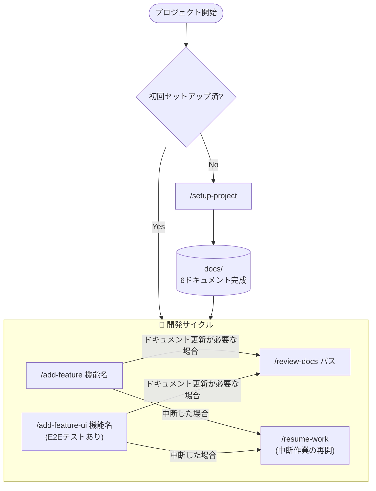
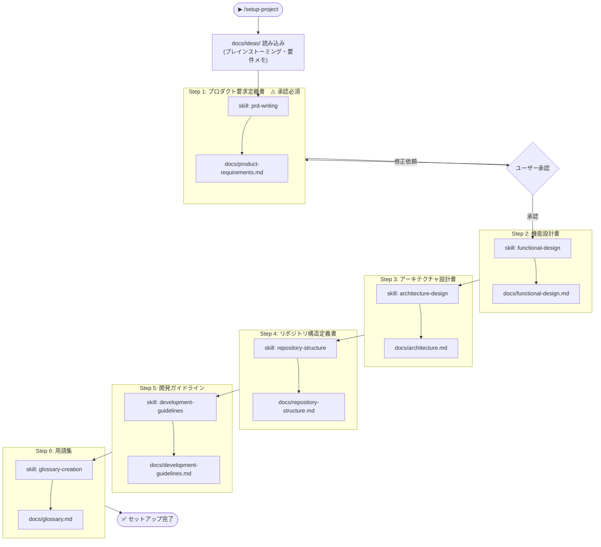
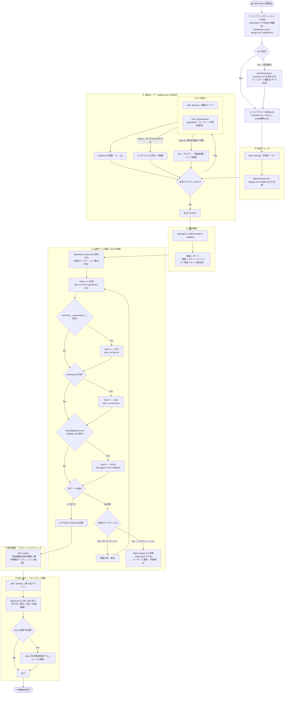
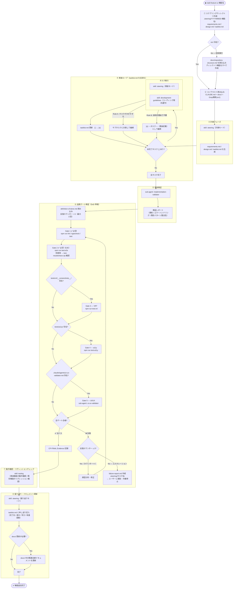
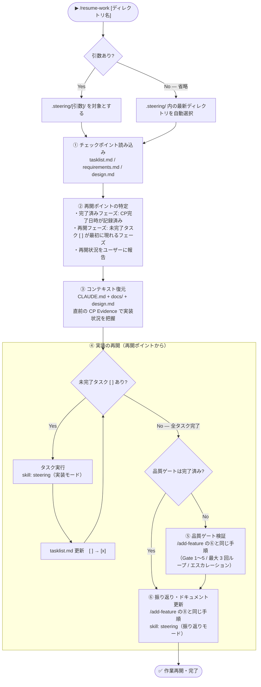
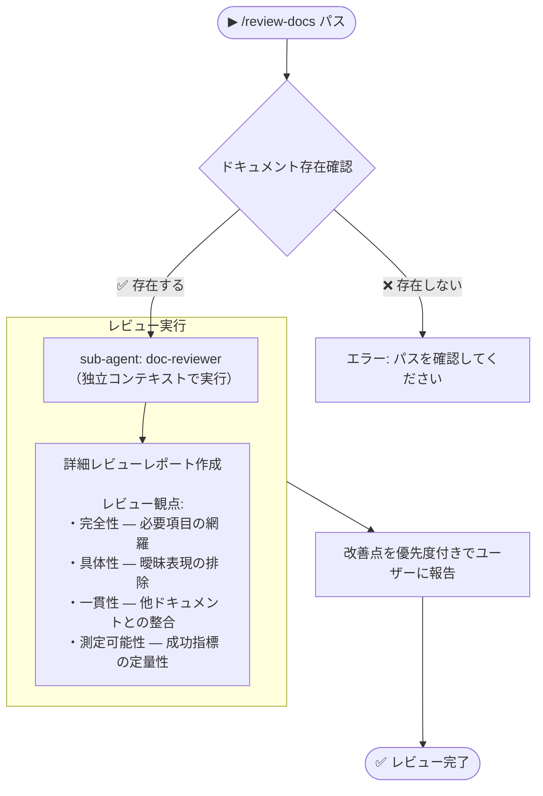

# SDD (Spec Driven Development) ワークフロー

SDD は「仕様を先に書き、仕様に従って実装する」開発手法です。
ドキュメントを正とし、Claude が自律的に計画・実装・検証までを担います。

---

## 目次

1. [全体フロー](#全体フロー)
2. [コマンド一覧](#コマンド一覧)
3. [/setup-project](#setup-project) — 初回セットアップ（6ドキュメント作成）
4. [/add-feature](#add-feature) — 機能追加（標準）
5. [/add-feature-ui](#add-feature-ui) — 機能追加（E2Eテストあり）
6. [/resume-work](#resume-work) — 中断作業の再開
7. [/review-docs](#review-docs) — ドキュメントレビュー
8. [品質ゲート一覧](#品質ゲート一覧)
9. [スキル・サブエージェント 参照マップ](#スキルサブエージェント-参照マップ)

---

## 全体フロー

---

## コマンド一覧

| コマンド | 用途 | タイミング |
|---------|------|-----------|
| `/setup-project` | 6種のドキュメントを順番に作成し、プロジェクト基盤を確立する | プロジェクト初回のみ |
| `/add-feature <機能名>` | 計画→実装→検証→振り返りを一貫して実行する | 通常の機能追加時 |
| `/add-feature-ui <機能名>` | `/add-feature` に加え E2E テスト（Gate 2）を必須実行する | UI を伴う機能追加時 |
| `/resume-work [ディレクトリ名]` | 中断したタスクを `tasklist.md` のチェックポイントから再開する | 作業が途中で止まった場合 |
| `/review-docs <パス>` | サブエージェントがドキュメントを独立コンテキストで精査し改善点を報告する | ドキュメント品質を上げたい時 |

---

## /setup-project

プロジェクト開始時に **1回だけ** 実行します。
`docs/ideas/` 配下のブレインストーミングメモを起点に、6種の永続ドキュメントを順番に生成します。
**Step 1（PRD）のみユーザー承認が必須**で、承認後に後続ステップへ進みます。

---

## /add-feature

機能追加の標準コマンドです。
「計画 → 実装 → 検証 → 品質ゲート → 動作確認 → 振り返り」の8フェーズを自動で実行します。

> **実装ループのルール**
> - **Rule A**: タスクが大きすぎる場合、サブタスクに分割して継続
> - **Rule B**: 技術的理由で不要なタスクは `[x] ~~タスク名~~ (理由)` として記録しスキップ

---

## /add-feature-ui

`/add-feature` と同一フローですが、**Gate 2（E2E テスト）が必須**で追加されます。
UI コンポーネントや画面遷移を含む機能追加時に使用してください。

> **Gate 2 失敗時**: `test-results/trace.zip` を Playwright Trace Viewer で確認してください。

---

## /resume-work

`/add-feature` または `/add-feature-ui` で開始した作業が中断した場合に、
`tasklist.md` のチェックポイントから作業を再開します。

引数を省略すると `.steering/` 内の**最新ディレクトリを自動選択**します。

---

## /review-docs

指定したドキュメントをサブエージェントが**独立したコンテキスト**で精査します。
メインの会話コンテキストを汚染せずに、客観的な品質チェックが行えます。

---

## 品質ゲート一覧

| Gate | 必須 / 条件付き | コマンド | 発動条件 |
|------|---------------|---------|---------|
| **Gate 1** — lint / typecheck / test | ✅ 必須 | `npm run lint` `npm run typecheck` `npm test` | 常に実行 |
| **Gate 2** — E2E テスト | ✅ 必須（`/add-feature-ui` のみ） | `npm run test:e2e` | `/add-feature-ui` 使用時 |
| **Gate 3** — ビジュアルリグレッション | 条件付き | `npm run test:vrt` | `tests/vrt/__screenshots__/` が存在する場合 |
| **Gate 4** — アクセシビリティ | 条件付き | `npm run test:a11y` | `tests/a11y/` が存在する場合 |
| **Gate 5** — UI/UX 検証 | 条件付き | sub-agent: `ui-ux-validator` | `.claude/agents/ui-ux-validator.md` が存在する場合 |

> **失敗時のルール**: 最大 3 回まで原因分析・修正を繰り返します。3 回を超えた場合は `failure-report.md` を作成してユーザーに報告し、作業を停止します。

---

## スキル・サブエージェント 参照マップ

| コマンド | フェーズ | 呼び出し先 | 種別 | 役割 |
|---------|---------|-----------|------|------|
| `/setup-project` | Step 1 | `prd-writing` | skill | PRD 作成ガイド |
| `/setup-project` | Step 2 | `functional-design` | skill | 機能設計書テンプレート |
| `/setup-project` | Step 3 | `architecture-design` | skill | アーキテクチャ設計テンプレート |
| `/setup-project` | Step 4 | `repository-structure` | skill | リポジトリ構造テンプレート |
| `/setup-project` | Step 5 | `development-guidelines` | skill | 開発ガイドラインテンプレート |
| `/setup-project` | Step 6 | `glossary-creation` | skill | 用語集テンプレート |
| `/add-feature` | ③ 計画 | `steering`（計画モード） | skill | ステアリングファイル自動生成 |
| `/add-feature` | ④ 実装 | `steering`（実装モード） | skill | `tasklist.md` 更新管理 |
| `/add-feature` | ④ 実装 | `development-guidelines` | skill | コーディング規約の適用 |
| `/add-feature` | ⑤ 検証 | `implementation-validator` | sub-agent | 実装品質の独立検証 |
| `/add-feature` | ⑥ Gate 5 | `ui-ux-validator` | sub-agent | UI/UX 品質の検証（条件付き） |
| `/add-feature` | ⑦ 確認 | `testing` | skill | 動作確認・リグレッションチェック |
| `/add-feature` | ⑧ 振り返り | `steering`（振り返りモード） | skill | 申し送り記入 |
| `/add-feature-ui` | 全フェーズ | `/add-feature` と同じ | — | Gate 2（E2E）が必須で追加 |
| `/resume-work` | ④ 実装 | `steering`（実装モード） | skill | 中断箇所からの実装再開 |
| `/resume-work` | ⑥ 振り返り | `steering`（振り返りモード） | skill | 申し送り記入 |
| `/review-docs` | レビュー | `doc-reviewer` | sub-agent | ドキュメントの詳細レビュー |
