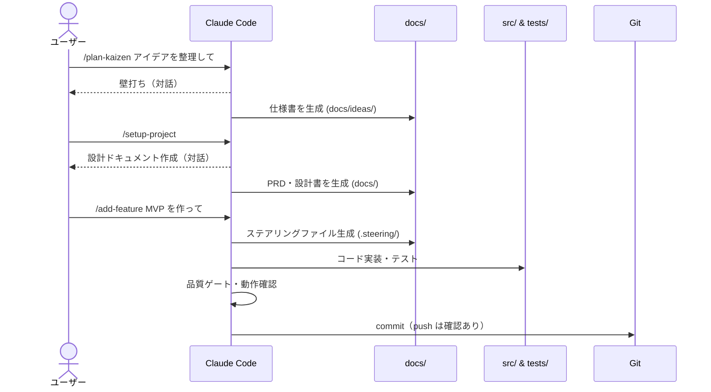
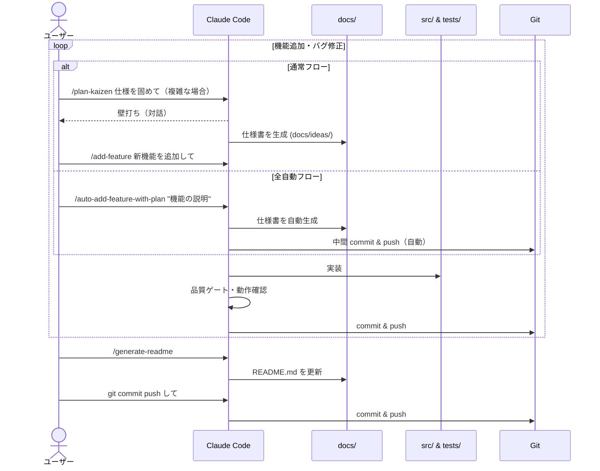

# Claude Code SDD Template


## これは何？

**Claude Code でアプリ開発を始めるためのプロジェクトテンプレート**です。

「仕様を先に書き、仕様に従って実装する」**Spec Driven Development (SDD)** のワークフローが組み込まれており、Claude Code のスラッシュコマンドだけでアプリの企画から実装・テストまでを進められます。

### こんな人におすすめ

- Claude Code でアプリを作りたいが、どこから始めればいいかわからない
- AI にコードを書かせるとき、仕様が曖昧で手戻りが多い
- プロジェクトの構成やドキュメント管理のベストプラクティスが欲しい

## クイックスタート

### 1. テンプレートを導入する

```bash
# 方法A: リポジトリをテンプレートとしてクローン
git clone https://github.com/your-org/claude-code-sdd-template.git my-app
cd my-app

# 方法B: 既存プロジェクトに追加（.claude/ と CLAUDE.md をコピー）
cp -r /path/to/template/.claude/ .claude/
cp /path/to/template/CLAUDE.md CLAUDE.md
```

### 2. Playwright をインストールする（任意）

E2E テストやスクリーンショット撮影を使う場合に必要です。

```bash
# Playwright CLI
npm install -g @playwright/cli@latest
playwright-cli install           # ブラウザをインストール
playwright-cli install --skills  # Claude Code にスキル登録

# Playwright MCP（より高度な操作が必要な場合）
claude mcp add --scope user playwright -- npx @playwright/mcp@latest
npx playwright install
```

> Playwright CLI と MCP の違いは [付録: Playwright CLI vs MCP](#付録-playwright-cli-vs-mcp) を参照してください。

### 3. アプリを作る

Claude Code を起動して、以下の順番でコマンドを実行するだけです。

```
① /plan-kaizen アプリのアイデアをブラッシュアップして
② /setup-project
③ /add-feature アプリMVPを作って
```

## 開発ワークフロー

### 初回実装

アイデアから MVP を作るまでの 3 ステップです。



#### ① 企画: アイデアを整理する

1. アイデアメモを `docs/ideas/` に書く（箇条書きでOK）
2. `/plan-kaizen docs/ideas/メモ.md をブラッシュアップして` を実行
3. Claude Code との対話で、課題・ターゲット・MVP範囲を整理

#### ② 設計: 仕様書を自動生成する

1. `/setup-project` を実行
2. 対話形式で6種類の設計ドキュメントが `docs/` に生成される

#### ③ 実装: コードを自動生成する

1. `/add-feature アプリMVPを作って` を実行
2. 計画 → 実装 → 品質チェック → 動作確認が自動で進行
3. `src/` にソースコード、`tests/` にテストコードが生成される

> E2E テスト付きで実装したい場合は `/add-feature-ui` を使います。

---

### 機能追加

MVP 完成後の継続的な開発サイクルです。



#### ④ 機能追加・バグ修正

- 簡単な変更: `/add-feature ユーザープロフィール編集を追加して`
- 複雑な変更: まず `/plan-kaizen` で仕様を固めてから `/add-feature` で実装
- **バグ修正**: `/fix-bug ログイン後にリダイレクトされない` — 再現手順が確立できない場合は停止してユーザーに報告します
- **確認なしで一気に進めたい場合**: `/auto-add-feature-with-plan "機能の説明"` を使うと、仕様策定（plan-kaizen）→ 実装（add-feature）→ コミット・push まで自動完走します
  - GitHub Issue を参照: `/auto-add-feature-with-plan #42`
  - E2E テスト付き: `/auto-add-feature-ui-with-plan "機能の説明"`
- **中断した作業の再開**: `/resume-work` — `tasklist.md` の Handoff セクション（中断時に記録）から状態を復元します

> ⚠️ **auto系コマンドの注意点**: 小規模・低リスクな変更に限定して使用してください。
> 以下のような変更では、通常の `/add-feature` を使い、各ステップを確認しながら進めることを推奨します:
> - DB スキーマ変更・マイグレーション
> - 認証・認可ロジックの変更
> - 外部 API 連携の追加・変更
> - ファイル・ディレクトリの削除
> - 大量ファイル変更（10 ファイル以上が目安）
> - 破壊的な後方互換性破壊

#### ⑤ リポジトリ更新: README と Git を最新化する

実装が一段落したら README と Git を更新します。

1. `/generate-readme` を実行して README.md を最新状態に更新
2. Claude Code に直接「git commit push して」と依頼

## コマンド一覧

| コマンド | 用途 | いつ使う？ |
|---------|------|-----------|
| `/plan-kaizen` | アイデアの壁打ち・仕様整理（10の観点で深掘り） | 新機能を考えるとき |
| `/setup-project` | 6種の設計ドキュメント生成 | プロジェクト初回のみ |
| `/add-feature` | 機能の実装（計画→実装→検証） | コードを書くとき |
| `/add-feature-ui` | 機能の実装（E2Eテスト付き・高リスク変更は停止確認） | UI を含む機能を作るとき |
| `/auto-add-feature-with-plan` | 仕様策定→実装→コミット・pushを一括自動実行 | 小規模・低リスク変更を確認なしで進めたいとき |
| `/auto-add-feature-ui-with-plan` | 仕様策定→実装（E2E付き）→コミット・pushを一括自動実行 | 同上（E2Eあり） |
| `/fix-bug` | バグ修正（再現→最小化→仮説→修正→回帰確認） | バグを再現してから確実に直したいとき |
| `/resume-work` | 中断した作業の再開（Handoff セクションから復元） | 途中で止まった作業を続けるとき |
| `/review-docs` | ドキュメントのレビュー | ドキュメントの品質を確認したいとき |
| `/generate-readme` | README.md の自動生成 | README を更新したいとき |

### Claude Code ビルトインコマンド（活用推奨）

| コマンド | 用途 | いつ使う？ |
|---------|------|-----------|
| `/run-skill-generator` | プロジェクト固有の起動・検証スキルを生成 | 新規プロジェクト作成後、または起動方法・環境が変わったとき |
| `/run` | アプリ起動と基本動作確認 | 動作を手軽に確認したいとき |
| `/verify` | 実装後の動作確認（**実装完了の必須条件**） | コード変更後・必ず実施すること |

## スキル一覧

スキルはコマンドから自動で呼び出される内部モジュールです。直接呼び出すことは[ガードレール](.claude/rules/workflow-guardrails.md)で禁止されています。

| スキル | 概要 | 呼び出し元 |
|--------|------|-----------|
| `steering` | 作業計画・タスクリスト（`.steering/`）の作成と進捗管理 | `/add-feature`, `/add-feature-ui`, `/resume-work` |
| `testing` | 実装後の動作確認・リグレッションチェック | `/add-feature`, `/add-feature-ui` |
| `playwright-cli` | Playwright CLI によるブラウザ自動操作 | `/add-feature-ui`, `/testing` |
| `prd-writing` | プロダクト要求定義書（PRD）の作成 | `/setup-project` |
| `architecture-design` | アーキテクチャ設計書の作成 | `/setup-project` |
| `functional-design` | 機能設計書の作成 | `/setup-project` |
| `development-guidelines` | 開発ガイドライン・コーディング規約の作成 | `/setup-project` |
| `repository-structure` | リポジトリ構造定義書の作成 | `/setup-project` |
| `glossary-creation` | ユビキタス言語・用語集の作成 | `/setup-project` |

## サブエージェント一覧

サブエージェントはコマンドから `Agent` ツール経由で起動される専門エージェントです。`.claude/agents/` に定義が置かれています。

| サブエージェント | 概要 | 呼び出し元 |
|----------------|------|-----------|
| `implementation-validator` | 実装差分と仕様書の適合性・コード品質・テストカバレッジ・セキュリティを検証 | `/add-feature`, `/add-feature-ui` |
| `ui-ux-validator` | 画面表示・操作フロー・デザイン一貫性など機械的テストで検出できない UI/UX 問題をレビュー | `/add-feature-ui` |
| `screenshot-capture` | Playwright CLI でアプリ画面を自動撮影し `docs/screenshots/` に保存（README 向け） | `/generate-readme` |
| `doc-reviewer` | README・設計書・tasklist・仕様書の整合性・完結性・誤記をレビューし改善提案 | `/review-docs` |

## ルール一覧

ルールは Claude Code の全会話に自動適用されるガードレールです。`.claude/rules/` に定義が置かれています。

| ルール | 概要 |
|--------|------|
| `workflow-guardrails` | 実装前に仕様書・ステアリングファイルの作成を強制し、ワークフローの迂回を防止する |

## ディレクトリ構成

```
プロジェクトルート/
├── .claude/                  # テンプレート本体（Claude Code の設定）
│   ├── commands/             #   スラッシュコマンド定義
│   ├── agents/               #   サブエージェント定義
│   ├── skills/               #   スキル定義
│   ├── rules/                #   ガードレール（全会話に自動適用）
│   ├── docs/guidelines/      #   開発ガイドライン・技術スタック選定
│   └── settings.json         #   Hooks・パーミッション設定
├── CLAUDE.md                 # プロジェクトメモリ（Claude Code が常に参照）
│
├── docs/                     # 設計ドキュメント（/setup-project で生成）
│   ├── glossary.md           #   プロジェクト共有言語（ドメイン用語・命名規則）
│   ├── ideas/                #   アイデアメモ・壁打ち結果・仕様書
│   └── adr/                  #   アーキテクチャ意思決定記録
├── .steering/                # 変更単位の実行仕様（/add-feature で生成）
├── src/                      # ソースコード（/add-feature で生成）
└── tests/                    # テストコード（/add-feature-ui で生成）
```

### docs/ / docs/ideas/ / .steering/ の使い分け

| ディレクトリ / ファイル | 役割 | 作成タイミング |
|---|---|---|
| `docs/` | プロダクト全体の長期ドキュメント（PRD・設計書など） | `/setup-project` 実行時 |
| `docs/glossary.md` | プロジェクト共有言語（ドメイン用語・命名規則・禁止語） | `/setup-project` 実行時に生成 |
| `docs/ideas/` | アイデアメモ・壁打ち結果・仕様書（実装前の素材） | `/plan-kaizen` 実行時 |
| `.steering/YYYYMMDD-name/` | 変更単位の実行仕様（requirements / design / tasklist） | `/add-feature` 実行時 |

- `docs/` はプロダクトの全体像を定義する **長期ドキュメント**
- `docs/glossary.md` はプロジェクト全体で用語・命名を統一するための **共有言語** （存在する場合、コマンドが自動参照する）
- `docs/ideas/` は実装前に固める **仕様素材**（実装後も残す）
- `.steering/` は1変更ごとに作る **作業ログ**（Handoff セクションで中断・再開を記録）

## カスタマイズ

### 技術スタックを変更する

`.claude/docs/guidelines/tech-stack-guidelines.md` を編集してください。

デフォルトでは以下の構成になっています:

| | 開発モード | 本番モード |
|---|---|---|
| **フロントエンド** | バニラJS + FastAPI配信 | React + Next.js + Tailwind CSS |
| **バックエンド** | Python + FastAPI | Python + FastAPI |
| **データベース** | SQLite | PostgreSQL |

### Hooks（品質自動チェック）を変更する

`.claude/settings.json` の `hooks` セクションを編集してください。

デフォルトでは、ファイル編集後に `npm run lint` が自動実行されます。プロジェクトの技術スタックに合わせてカスタマイズしてください。

### ガードレールを変更する

`.claude/rules/` 配下のファイルを編集してください。ここに置いたルールは Claude Code の全会話に自動適用されます。

## 参考ドキュメント

| ドキュメント | 内容 |
|-------------|------|
| [definition-of-done.md](.claude/docs/guidelines/definition-of-done.md) | 品質ゲートの定義・フィードバック速度の階層 |
| [development-guidelines.md](.claude/docs/guidelines/development-guidelines.md) | コーディング規約・AIアンチパターン |
| [repository-structure-guidelines.md](.claude/docs/guidelines/repository-structure-guidelines.md) | ディレクトリ構造ガイドライン |
| [tech-stack-guidelines.md](.claude/docs/guidelines/tech-stack-guidelines.md) | 技術スタック選定ガイドライン |
| [docs/adr/README.md](docs/adr/README.md) | ADR（アーキテクチャ意思決定記録）の運用ルール |

## 変更履歴

| 日付 | 変更内容 |
|------|---------|
| 2026-06-01 | `/fix-bug` コマンド新規追加・TDD/red-green-refactor 方針・Handoff 支援（中断・再開記録）・`add-feature-ui` 安全停止強化・`docs/glossary.md` 共有言語化・`implementation-validator` 構造レビュー追加 |
| 2026-05-26 | ビルトインコマンド（/run-skill-generator, /run, /verify）運用方針を統合・auto系安全チェック強化・開発ガイドライン拡充 |
| 2026-04-03 | auto-add-feature-with-plan / auto-add-feature-ui-with-plan コマンドを追加 |
| 2026-04-03 | README にサブエージェント一覧・ルール一覧・Mermaid ワークフロー図を追加 |
| 2026-03-27 | generate-readme コマンドに変更履歴セクション自動生成機能を追加 |

<details>
<summary>過去の変更履歴</summary>

| 日付 | 変更内容 |
|------|---------|
| 2026-03-26 | plan-kaizen と plan モードの競合防止ガードレールを追加 |
| 2026-03-25 | README 刷新・ベストプラクティスドキュメント整理 |
| 2026-03-18 | Hooks 品質チェック・ADR ガイドライン・参考ドキュメント拡充 |
| 2026-03-16 | フィードバック速度改善・開発ガイドライン追加・セッション継続性強化 |
| 2026-03-10 | テンプレートのスキル・コマンド・ドキュメントを細部改善 |
| 2026-03-03 | plan-kaizen コマンドを追加し、テンプレートをリニューアル |
| 2026-02-23 | 仕様駆動開発で生成されたドキュメントを .gitignore から削除 |
| 2026-02-18 | Codex 用エージェント定義を追加 |
| 2026-02-03 | 初期リリース（スキルテンプレート基盤構築） |

</details>

---

## 付録: Playwright CLI vs MCP

| | [Playwright CLI](https://github.com/microsoft/playwright-cli) | [Playwright MCP](https://github.com/microsoft/playwright-mcp) |
|---|---|---|
| 概要 | コマンドラインでブラウザを操作 | MCP サーバー経由でブラウザを操作 |
| トークン消費 | 少ない | 多い |
| 得意なこと | 定型的な操作・CI自動化・コスト重視 | 未知のUI探索・自然言語での柔軟な操作 |
| おすすめ | **まずはこちらから** | 高度な操作が必要な場合 |

### Playwright CLI の動作確認

```
/playwright-cli https://example.com にアクセスしてスクリーンショットを撮って
```

### Playwright MCP の動作確認

```
playwright mcp で https://example.com にアクセスして、検索ボックスに「テスト」と入力して検索結果のスクリーンショットを撮って
```

<!-- readme-generated: 2026-06-01T00:00:00 -->
