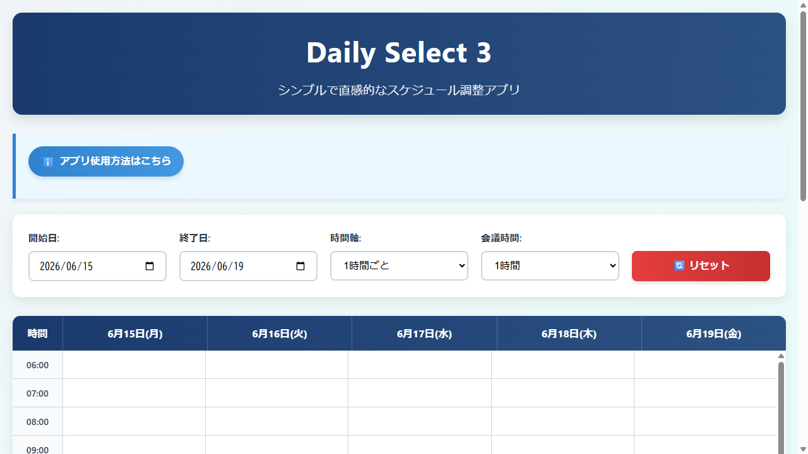
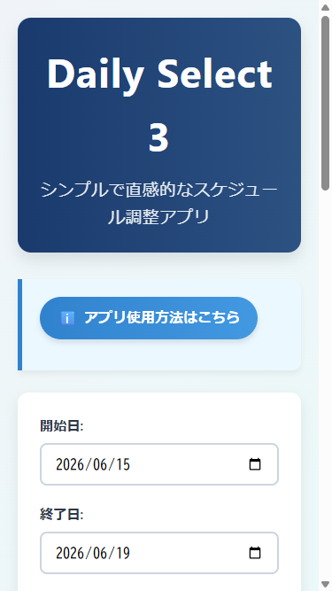

# Daily Select - スケジュール調整アプリケーション


## 概要

Daily Selectは、ビジネスユーザーが会議などの候補日程を直感的に入力・選択できるスケジュール調整アプリケーションです。特に設定不要のシンプルなUIを特徴とし、複雑な操作なしに迅速に日程調整が可能です。

## スクリーンショット




## 主な機能

- **候補日時入力機能**: カレンダー形式での日程候補の登録と表示
- **時間帯比較表示機能**: 複数人の空き時間帯を一覧形式で比較表示
- **日程確定機能**: 最適な日時を選択して確定表示できる
- **データ保存機能**: 入力データをローカルストレージに自動保存・復元
- **レスポンシブデザイン**: PC中心だが、モバイル端末でも利用可能
- **共有リンク生成機能**: 他の参加者に共有するための簡単なリンクコピー機能

## 技術スタック

| カテゴリ | 技術 |
|---------|------|
| フロントエンド | HTML5, CSS3, JavaScript (Vanilla JS) |
| データベース | ローカルストレージ |
| テスト | Playwright |

## セットアップ

### 前提条件

- モダンなWebブラウザ（Chrome, Firefox, Safariなど）

### インストール

```bash
# リポジトリのクローン
git clone <repository-url>
cd "daily select ver3.1"

# アプリケーションファイルを開く
# src/daily-select-ver3.html をブラウザで開く
```

### 起動

```bash
# ブラウザで直接HTMLファイルを開く
open src/daily-select-ver3.html
# または
start src/daily-select-ver3.html
```

## 使い方

1. ブラウザで `src/daily-select-ver3.html` を開く
2. カレンダー上の時間帯をクリックして候補日時を選択
3. 「日本語形式」または「標準形式」を選択
4. 「クリップボードにコピー」ボタンで結果をコピー
5. 参加者に共有して空き時間を登録してもらう

## 変更履歴

| 日付 | 変更内容 |
|------|---------|
| 2026-06-16 | README.md を新規生成、スクリーンショットを追加 |
| 2026-06-15 | Daily Select 3 アプリケーションの実装を開始 |
| 2026-06-01 | README にインフォグラフィック画像を追加 |
| 2026-06-01 | テンプレート改善 v2 - バグ修正フロー・TDD方針・Handoff支援・安全停止強化 |
| 2026-06-01 | README を 2026-06-01 版に更新 |

<details>
<summary>過去の変更履歴</summary>

| 日付 | 変更内容 |
|------|---------|
| 2026-05-26 | ビルトインコマンド統合・auto系安全チェック強化・ガイドライン拡充 |
| 2026-04-03 | auto-add-feature-with-plan / auto-add-feature-ui-with-plan コマンドを追加 |
| 2026-04-03 | READMEのサブエージェント説明文を更新し生成タイムスタンプを最新化 |
| 2026-03-27 | READMEに変更履歴セクションとタイムスタンプを追加 |
| 2026-03-26 | plan-kaizen と plan モードの競合防止ガードレール追加 |
| 2026-03-25 | README刷新・ベストプラクティスドキュメント整理・vendor削除 |
| 2026-03-18 | スクリーンショット散乱防止 - PostToolUse Hook自動移動 + .gitignore |
| 2026-03-16 | Hooks強化・ADR自動生成・Lefthookプリコミット導入 |
| 2026-03-03 | テンプレート改善3提案を実装 |
| 2026-02-03 | 初期リリース（スキルテンプレート基盤構築） |

</details>

## ライセンス

MIT License

Copyright (c) 2026 

Permission is hereby granted, free of charge, to any person obtaining a copy
of this software and associated documentation files (the "Software"), to deal
in the Software without restriction, including without limitation the rights
to use, copy, modify, merge, publish, distribute, sublicense, and/or sell
copies of the Software, and to permit persons to whom the Software is
furnished to do so, subject to the following conditions:

The above copyright notice and this permission notice shall be included in all
copies or substantial portions of the Software.

THE SOFTWARE IS PROVIDED "AS IS", WITHOUT WARRANTY OF ANY KIND, EXPRESS OR
IMPLIED, INCLUDING BUT NOT LIMITED TO THE WARRANTIES OF MERCHANTABILITY,
FITNESS FOR A PARTICULAR PURPOSE AND NONINFRINGEMENT. IN NO EVENT SHALL THE
AUTHORS OR COPYRIGHT HOLDERS BE LIABLE FOR ANY CLAIM, DAMAGES OR OTHER
LIABILITY, WHETHER IN AN ACTION OF CONTRACT, TORT OR OTHERWISE, ARISING FROM,
OUT OF OR IN CONNECTION WITH THE SOFTWARE OR THE USE OR OTHER DEALINGS IN THE
SOFTWARE.

<!-- readme-generated: 2026-06-16T09:30:00 -->