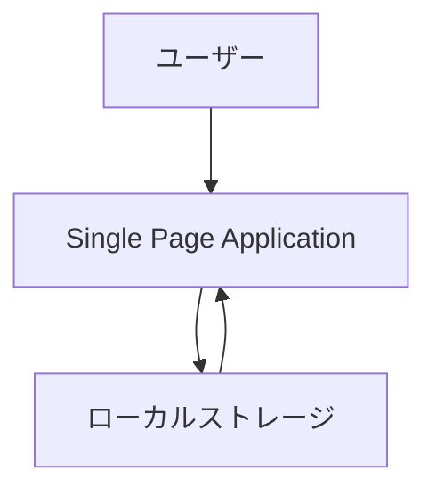
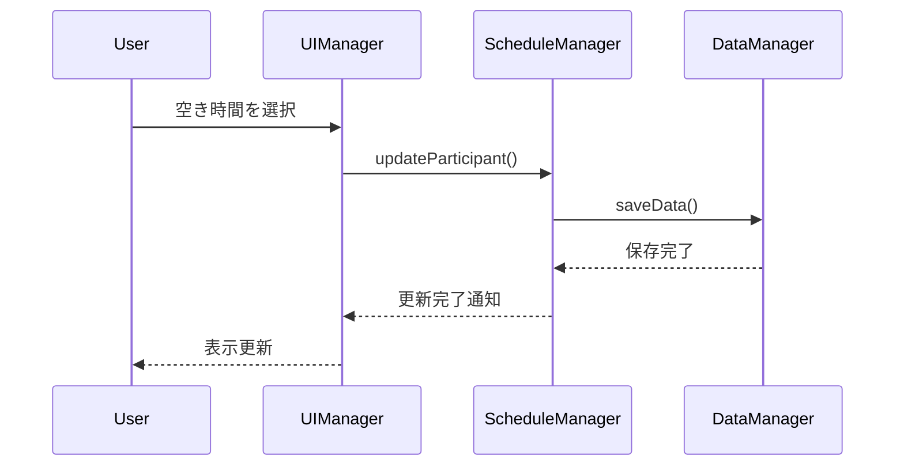
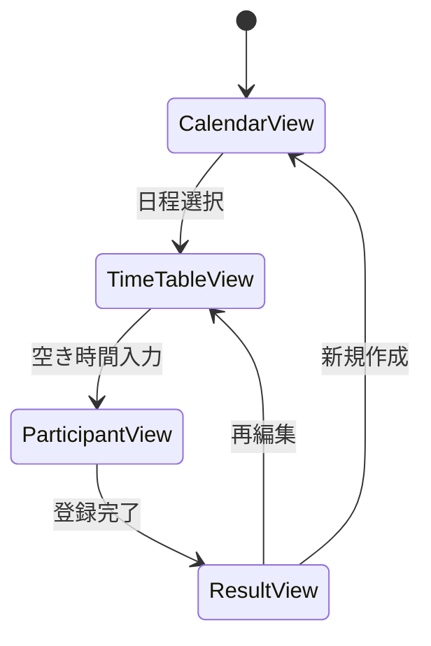

# 機能設計書 (Functional Design Document)

## システム構成図



## 技術スタック

| 分類 | 技術 | 選定理由 |
|------|------|----------|
| 言語 | HTML/CSS/JavaScript | 単一ファイルでの動作要件を満たすため |
| フレームワーク | Vanilla JS | フレームワーク未使用の制約に基づく |
| データベース | ローカルストレージ | 外部サーバー接続不要でデータ保存可能なため |
| ツール | なし | 単体HTMLファイルでの実行要件を満たすため |

## データモデル定義

### エンティティ: ScheduleEvent

```javascript
{
  id: string;              // UUID形式の一意識別子
  title: string;           // 予定のタイトル
  date: string;            // YYYY-MM-DD形式の日付
  startTime: string;       // HH:mm形式の開始時間
  endTime: string;         // HH:mm形式の終了時間
  participants: Array;     // 参加者の空き時間情報配列
  createdAt: string;       // 作成日時（ISO 8601形式）
  updatedAt: string;       // 更新日時（ISO 8601形式）
}
```

### エンティティ: ParticipantAvailability

```javascript
{
  id: string;              // 参加者ごとの識別子
  name: string;            // 参加者名
  availableSlots: Array;   // 空き時間スロットの配列
}
```

### エンティティ: TimeSlot

```javascript
{
  startTime: string;       // HH:mm形式の開始時間
  endTime: string;         // HH:mm形式の終了時間
  available: boolean;      // 空き時間フラグ
}
```

## コンポーネント設計

### DateManager

**責務**:
- カレンダーの日付管理
- 日付範囲の選択とバリデーション
- 曜日の計算と表示

**インターフェース**:
```javascript
class DateManager {
  constructor();
  getDatesInRange(startDate, endDate);  // 指定範囲の日付リストを取得
  getNextWeek(date);                    // 指定日から1週間後の日付を取得
  getPreviousWeek(date);                // 指定日から1週間前の日付を取得
  formatDate(date);                     // 日付を表示用にフォーマット
}
```

### ScheduleManager

**責務**:
- スケジュール候補の作成・編集・削除
- ローカルストレージとのデータ連携
- 参加者データの管理

**インターフェース**:
```javascript
class ScheduleManager {
  constructor();
  createSchedule(data);                 // 新しいスケジュールを作成
  updateSchedule(id, data);             // 既存スケジュールを更新
  deleteSchedule(id);                   // スケジュールを削除
  getSchedule(id);                      // スケジュールを取得
  getAllSchedules();                    // 全スケジュールを取得
  addParticipant(scheduleId, participantData);  // 参加者を追加
  updateParticipant(scheduleId, participantId, availability);  // 参加者の空き時間を更新
}
```

### UIManager

**責務**:
- UI要素の表示・非表示制御
- ユーザー操作イベントのハンドリング
- データの視覚的表現（タイムテーブル）

**インターフェース**:
```javascript
class UIManager {
  constructor();
  renderCalendar(dates);                // カレンダーを描画
  renderTimeTable(scheduleData);        // タイムテーブルを描画
  bindEventListeners();                 // イベントリスナーを設定
  showInstructions();                   // 使用方法パネルを表示
  hideInstructions();                   // 使用方法パネルを非表示
  toggleInstructions();                 // 使用方法パネルの表示切り替え
  updateShareLink(url);                 // 共有リンクを更新
}
```

### DataManager

**責務**:
- ローカルストレージとのデータ読み書き
- データのシリアライズ・デシリアライズ
- データの永続化と復元

**インターフェース**:
```javascript
class DataManager {
  constructor();
  saveData(key, data);                  // データを保存
  loadData(key);                        // データを読み込み
  clearData(key);                       // データを削除
  exportToCSV(data);                    // CSV形式でエクスポート
}
```

## ユースケース図

### スケジュール作成


**フロー説明**:
1. ユーザーがUIを通して日程候補を入力する
2. UIManagerが入力データをScheduleManagerに渡す
3. ScheduleManagerが新しいスケジュールを作成し、DataManagerに保存依頼
4. DataManagerがローカルストレージにデータを保存
5. 保存完了後、共有リンクがユーザーに表示される

### 参加者の空き時間登録



**フロー説明**:
1. 参加者がUIを通して空き時間を選択する
2. UIManagerが選択データをScheduleManagerに渡す
3. ScheduleManagerが参加者の空き時間を更新し、DataManagerに保存依頼
4. DataManagerがローカルストレージのデータを更新
5. 更新完了後、タイムテーブルが最新状態で再表示される

## 画面遷移図



## UI設計

### タイムテーブル表示

**表示項目**:
| 項目 | 説明 | フォーマット |
|------|------|-------------|
| 日付 | スケジュール候補日 | MM/DD (曜日) |
| 時間帯 | 時間スロット | HH:mm-HH:mm |
| 参加者 | 空き時間状況 | ◯(空き) / ×(不可) |

### カラーコーディング

**色の使い分け**:
- 青: 選択可能な時間スロット (例: #4A90E2)
- 緑: すべての参加者が空いている時間 (例: #7ED321)
- 赤: 一部の参加者が空いていない時間 (例: #D0021B)
- 灰色: 選択不可時間・過去時間 (例: #9B9B9B)
- 白: デフォルト背景色 (例: #FFFFFF)

### インタラクティブモード

**操作フロー**:
1. 日付範囲を選択し、時間軸を設定する
2. 各日付の時間スロットをクリックして候補時間を登録
3. 「使用方法はこちら」パネルを開閉して操作説明を確認
4. 完了したら共有リンクをコピーして参加者に送信

## ファイル構造

**データ保存形式**:
```
localStorage/
├── dailySelect_schedules    # 作成されたスケジュールデータ
└── dailySelect_settings     # ユーザー設定データ
```

**ファイル内容例**:
```json
{
  "schedules": [
    {
      "id": "uuid-string",
      "title": "プロジェクトMTG",
      "dates": ["2026-07-01", "2026-07-03", "2026-07-05"],
      "timeSlots": [
        {"start": "09:00", "end": "10:00"},
        {"start": "14:00", "end": "15:00"}
      ],
      "participants": [],
      "createdAt": "2026-06-15T10:00:00Z"
    }
  ]
}
```

## パフォーマンス最適化

- DOM操作の最小化: 仮想DOMを模倣した差分更新方式を採用
- イベントリスナーの一元管理と削除: メモリリーク防止
- ローカルストレージアクセスのバッチ処理: 複数の保存操作をまとめて実行

## セキュリティ考慮事項

- データ暗号化: 保存データに軽量な暗号化を適用（オプション）
- XSS対策: ユーザー入力のエスケープ処理を徹底
- プライバシー: 全てのデータをブラウザ内に保持し、外部送信なし

## エラーハンドリング

### エラーの分類

| エラー種別 | 処理 | ユーザーへの表示 |
|-----------|------|-----------------|
| 入力不正 | 自動補正を試行 | 「入力値を確認してください」 |
| ストレージ上限 | 保存を中止し整理を促す | 「ストレージ容量が不足しています」 |
| ブラウザ非対応 | 代替表示を案内 | 「お使いのブラウザに対応していません」 |

## テスト戦略

### ユニットテスト
- DateManagerの日付操作機能
- ScheduleManagerのCRUD操作
- DataManagerの保存・読み込み機能

### 統合テスト
- UI操作からデータ保存までの流れ
- 複数ユーザーの同時入力シミュレーション

### E2Eテスト
- 新規スケジュール作成から共有までの一連の流れ
- 参加者による空き時間登録と反映確認