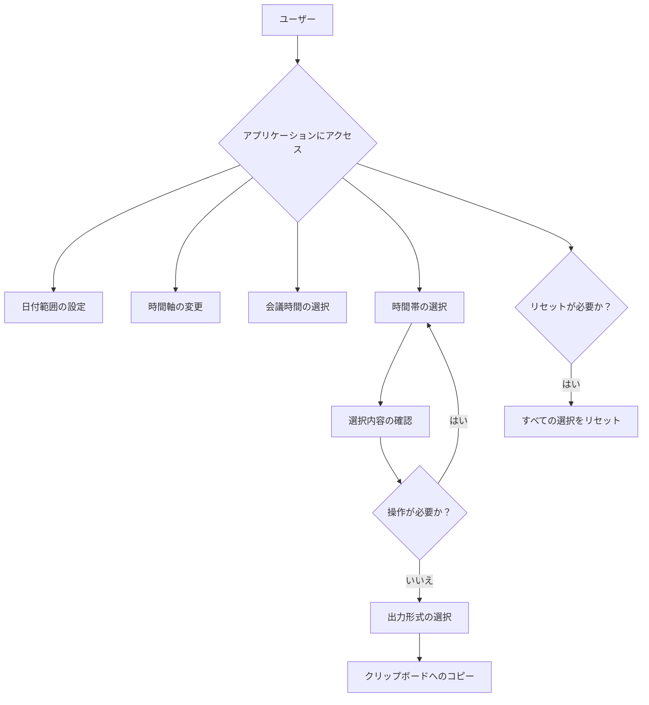

# Daily Select 2 アプリケーション 完全仕様書

> 作成日: 2026-06-15
> バージョン: 1.0
> ステータス: Complete
> 用途: アプリケーションの再現実装用仕様書

---

## 1. 製品概要

### 1.1 製品名
Daily Select 2

### 1.2 製品の概要
Daily Select 2は、個人ユーザーが会議などの候補日程を直感的に入力・選択できるスケジュール調整アプリケーションです。月曜日～金曜日の6:00-22:00の時間帯を視覚的に表示し、シンプルなクリック操作で時間帯を選択し、選択結果をテキスト形式で出力できます。Appleスタイルの洗練されたUIを持ち、1つのHTMLファイルで完結する自己完結型のウェブアプリケーションとして、オフラインでも利用可能です。

### 1.3 問題解決
個人や小規模チームが候補日程を調整する際に、複雑なツールやネットワーク接続を必要とせず、シンプルかつ迅速に候補日程を選択し、テキスト形式での出力が可能になります。これにより、メールやチャットでのスケジュール調整がより効率的になります。

## 2. ユーザーストーリーとユースケース

### 2.1 ターゲットユーザー
- **主なユーザー**: 個人ユーザー（ビジネスパーソン、学生、フリーランス等）
- **特性**: 
  - PC（Windows/Mac/Linux）での作業が主
  - 効率的な時間管理を求める
  - テクノロジーへの習熟度は中程度
  - スケジュール調整を頻繁に行う

### 2.2 ユーザーストーリー

#### MVP機能
1. 個人ユーザーとして、会議の候補日程を直感的なUIで簡単に選択できるようにしたい。
2. 個人ユーザーとして、選んだ候補日程を2種類の日付形式（日本語形式／標準形式）でテキスト出力できるようにしたい。
3. 個人ユーザーとして、ページを離れても選択内容が保持されているようにしたい。
4. 個人ユーザーとして、アプリケーションを1つのHTMLファイルで配布・利用できるようにしたい。

#### 追加機能
1. 個人ユーザーとして、日付範囲をカスタマイズできるようにしたい。
2. 個人ユーザーとして、30分区切りまたは1時間区切りで時間軸を変更できるようにしたい。
3. 個人ユーザーとして、会議時間を30分、1時間、1時間30分、2時間の中から選択し、連続した時間帯をまとめて選択できるようにしたい。
4. 個人ユーザーとして、選択をリセットできるようにしたい。

### 2.3 ユースケース図


## 3. 機能要件

### 3.1 MVP機能

#### スケジュール選択機能
- 月曜日～金曜日の5日間を横軸に表示
- 6:00-22:00の時間単位（1時間）を縦軸に表示
- セルクリックで選択状態を切り替え可能
- 選択されたセルは視覚的に区別される（AppleスタイルUI）

#### 出力形式選択機能
- 2種類の日付形式を選択可能：
  - 日本語形式：例）6月12日（月）9:00-10:00
  - 標準形式：例）2026/06/12 9:00-10:00

#### コピー機能
- 選択された時間帯を指定された形式でテキスト出力
- クリップボードにコピーするボタン

#### データ保持機能
- localStorageを使用して選択状態を保持
- ページ再読み込み後も選択内容が維持される

#### 単一ファイル化機能
- すべてのCSSおよびJavaScriptを1つのHTMLファイルに埋め込む
- 外部ファイルへの依存を解消し、単体で実行可能なHTMLファイル

### 3.2 追加機能

#### 日付範囲設定機能
- 開始日と終了日をカレンダー形式で選択
- 開始日は終了日以前、終了日は開始日以降に設定
- 土日は表示しない

#### 時間軸切替機能
- 30分区切りまたは1時間区切りを選択可能
- デフォルトは1時間区切り

#### 会議時間選択機能
- 30分、1時間、1時間30分、2時間を選択可能
- 選択した会議時間に応じて連続した時間帯が選択される
- デフォルトは1時間

#### リセット機能
- すべての選択をクリアするボタン
- 確認ダイアログを表示

## 4. 非機能要件

### 4.1 パフォーマンス
- ページ読み込み時間は3秒以内
- ファイルサイズは500KB以内を目指す
- 選択操作の応答性（クリックから反映まで100ms以内）

### 4.2 セキュリティ
- ユーザーデータを外部に送信しない
- localStorageに保存するデータはユーザー端末内に閉じたまま
- XSSやCSRFの脆弱性がないこと

### 4.3 アクセシビリティ
- WCAG 2.1 AA準拠を目指す
- キーボード操作での選択に対応
- スクリーンリーダーでの読み上げに対応

### 4.4 互換性
- 主要ブラウザでの動作（Chrome、Firefox、Safari、Edge最新版）
- モバイル端末での基本的な操作も可能
- Windows、macOS、Linuxでの動作

## 5. 技術仕様

### 5.1 技術スタック
- HTML5
- CSS3
- バニラJavaScript (ES6+)
- localStorage API
- Clipboard API

### 5.2 アーキテクチャ
- シングルページアプリケーション（SPA）
- すべてのコードを1つのHTMLファイルに内包
- クライアントサイドでのみ動作（サーバー不要）

### 5.3 ディレクトリ構造
```
src/
  frontend/
    daily select ver2.html (統合されたシングルファイル)
```

## 6. UI/UX設計

### 6.1 カラーパレット（Appleスタイル）
```css
:root {
    --apple-blue: #007AFF;
    --apple-green: #34C759;
    --apple-orange: #FF9500;
    --light-gray: #F2F2F7;
    --medium-gray: #E5E5EA;
    --dark-gray: #D1D1D6;
    --darker-gray: #C7C7CC;
    --darkest-gray: #AEAEB2;
    --white: #FFFFFF;
    --black: #000000;
}
```

### 6.2 レイアウト構成
1. ヘッダー
2. 設定パネル（日付範囲・時間軸・会議時間）
3. コントロールパネル（出力形式・コピー・リセット）
4. スケジュールグリッド
5. フィードバックパネル
6. フッター

## 7. 受け入れ条件

### MVP機能
- [ ] 月曜日～金曜日の5日間が正しく表示される
- [ ] 6:00-22:00の時間単位が1時間毎に正しく表示される
- [ ] セルクリックで選択状態が切り替わる
- [ ] 選択されたセルが視覚的に区別される（AppleスタイルUI）
- [ ] 2種類の日付形式が選択可能
- [ ] 選択された形式に応じてテキスト出力が変わる
- [ ] 選択された時間帯がテキスト形式で出力される
- [ ] クリップボードにコピーするボタンが正しく動作する
- [ ] localStorageを使用して選択状態が保持される
- [ ] ページ再読み込み後も選択内容が維持される
- [ ] すべてのCSSおよびJavaScriptが1つのHTMLファイルに埋め込まれる
- [ ] 外部ファイルへの依存がない

### 追加機能
- [ ] 開始日と終了日をカレンダー形式で選択可能
- [ ] 開始日は終了日以前、終了日は開始日以降に設定
- [ ] 土日は表示されない
- [ ] 30分区切りまたは1時間区切りを選択可能
- [ ] 選択した会議時間に応じて連続した時間帯が選択される
- [ ] すべての選択をクリアするボタンが正しく動作する

## 8. テスト方針

### 8.1 手動テスト
- 各機能の基本操作確認
- ブラウザ互換性テスト
- UI/UXの検証

### 8.2 自動テスト
- E2Eテスト（Playwright）

## 9. デプロイ方針

### 9.1 配布形式
- 単一のHTMLファイルのみ

### 9.2 利用方法
- ダウンロードしたHTMLファイルをブラウザで直接開く

## 10. 将来の拡張性

### 10.1 拡張ポイント
- ヘルプ機能の追加
- 多言語対応
- レスポンシブデザインの最適化
- アクセシビリティ改善

## 11. 関連ドキュメント

- プロダクト要求定義書: `docs/product-requirements.md`
- 機能設計書: `docs/functional-design.md`
- アーキテクチャ設計書: `docs/architecture.md`
- ADR: `docs/adr/`

---
*この仕様書は、Daily Select 2アプリケーションの完全な再実装が可能なレベルの詳細を含んでいます。*